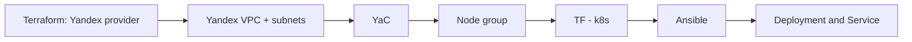

# IaC

# Terraform

* [main.tf](tf/main.tf)
* [variables.tf](tf/variables.tf)
* [outputs](tf/outputs.tf)

# Ansible

* [prep](ansible/prep.sh)
* [inventory](ansible/inventory.ini)
* [deployment playbook](ansible/deploy.yml)
* [run](ansible/run.sh)